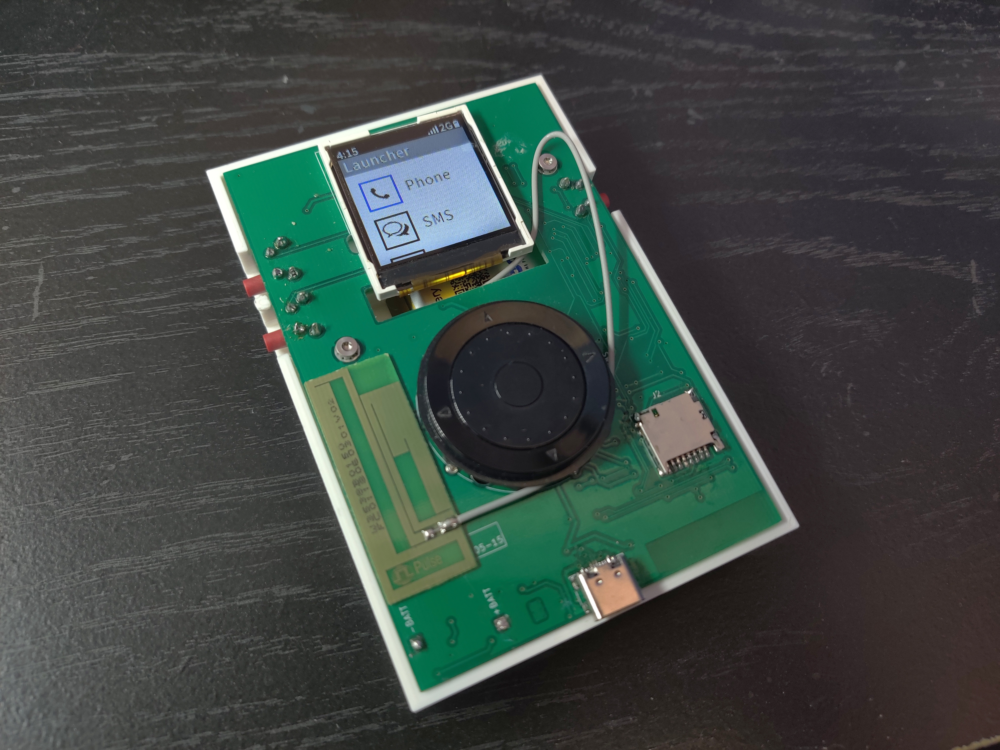
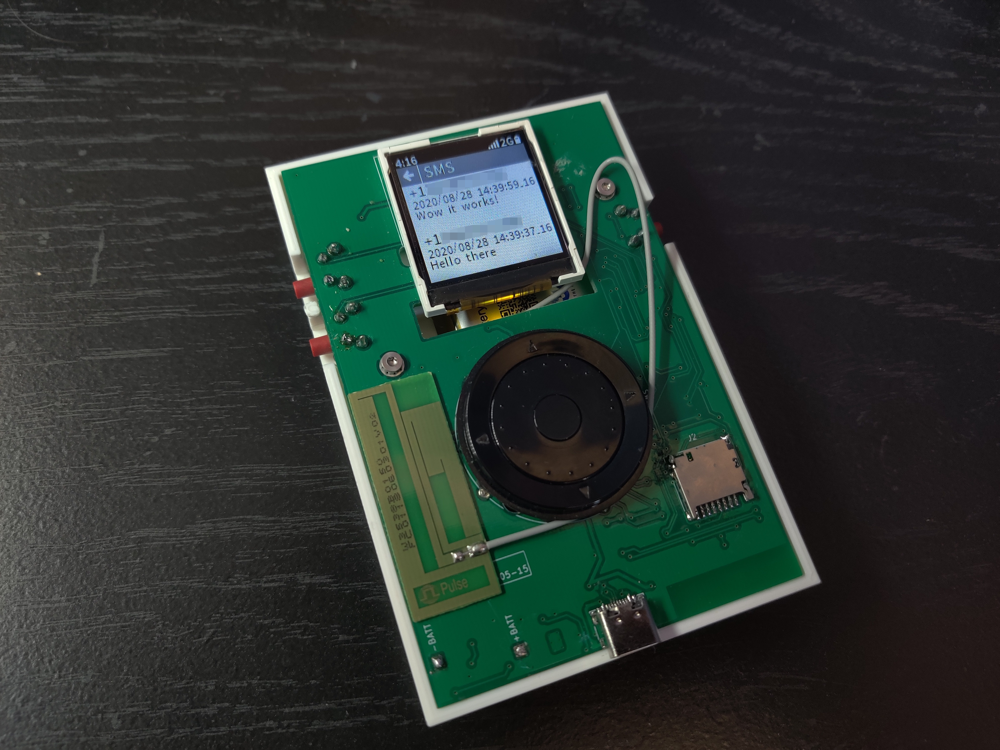
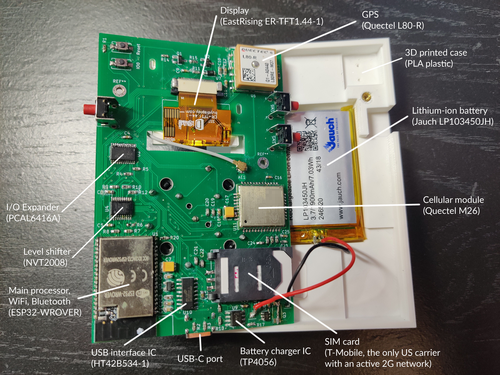
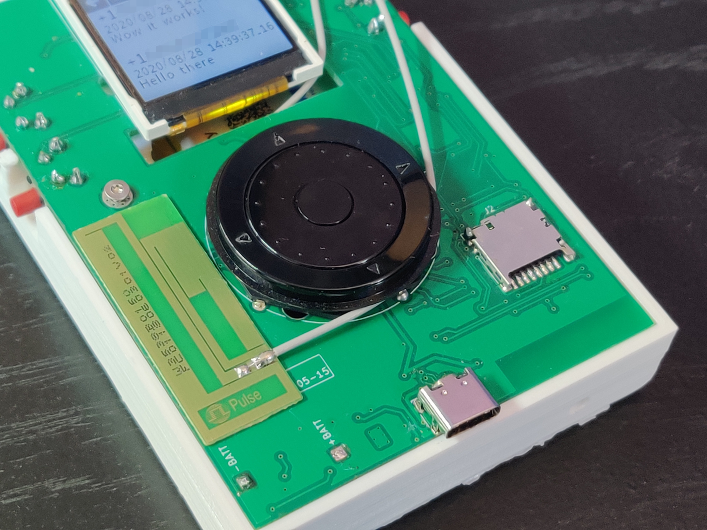

# phone

A custom-built (and functioning) cell phone, which I designed and built for my end-of-year project in my senior year of high school. It can make calls, receive texts, connect to the Internet, get your location, and do most things you'd expect a phone to be capable of.

You can see the different parts of the phone labeled below. The source code/files are split up over several different repostories:
* [phone-fw](https://github.com/thatoddmailbox/phone-fw) - the firmware running on the phone, written in C.
* [phone-eval-hw](https://github.com/thatoddmailbox/phone-eval-hw) - the PCB for the "evaluation board", which was the first revision of the hardware.
* [phone-hw](https://github.com/thatoddmailbox/phone-hw) - the PCB for the final product, which is shown in these images.
* [phone-debug-client](https://github.com/thatoddmailbox/phone-debug-client) - a small program that runs on a computer. The phone can connect to the computer over Wi-Fi to copy PNG screenshots over.

## Detailed photos
### Inside

### Outside

(from left to right: antenna, input wheel, micro-SD card slot)